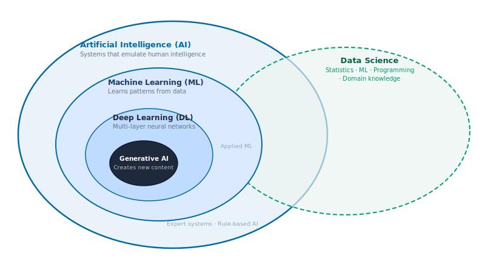
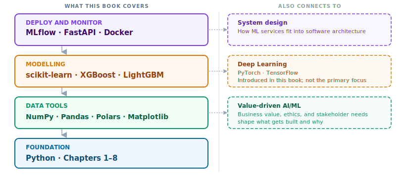

A smart meter logs 10,000 electricity readings per customer per year. Some customers are bypassing their meters. You are asked to build a system that catches them.

The natural first move is to write rules. If monthly consumption drops by 40%, flag the account. If recorded usage is consistently lower than the neighbourhood average, flag it. If the meter reading pattern changes after a maintenance visit, flag it.

You build the rules and test them. They catch some cases but miss many others. A family going on holiday looks like a thief. A household cutting back in winter looks suspicious. You add exceptions, then exceptions to the exceptions. Every new rule surfaces a case it handles incorrectly. And as theft patterns evolve, your rules become outdated before you finish writing them.

You cannot solve this by writing more rules. The combinations of factors are too numerous, too variable, and too context-dependent for any human to enumerate.

This is the problem that machine learning was built to solve. In traditional programming, you write the rules and the computer applies them. In machine learning, you reverse the flow: you provide data and labeled examples of the outcome you want, and the computer finds the rules. When the rules are too complex to write by hand, that reversal is the right move.

By the end of this chapter you will know what machine learning is, where it sits in the broader landscape, and why the 16 chapters of Python and data tools that follow are the most direct path to building systems that work.

<i class="bi bi-info-circle-fill"></i> Key Concept: when rules fail, patterns can be learned  
Traditional programming: you write the rules, the computer applies them to data. 
Machine learning: you provide labeled examples, the computer learns the rules from data.  
When the rules are too complex, too numerous, or simply unknown until you look at the data, switching from writing rules to learning from examples is the right approach. The energy theft problem above is one instance of this structure. Fraud detection, medical diagnosis, demand forecasting, and language translation are others.

## 1. Precise terms for a noisy conversation

"AI" is what headlines use. It covers everything from a chess engine to a text generator to a recommendation algorithm. Reaching for AI as the description of what you are building leads to poor decisions in practice: it overstates complexity, makes it harder to reason about data requirements, and obscures what the system can and cannot do.

This book uses three specific terms.

**Machine Learning (ML)** is a system that learns patterns from data instead of following rules written by hand. The energy theft detector above is ML. So is a model that forecasts next month's demand or classifies a chest X-ray.

**Data Science** is the broader practice that uses ML as one of its primary tools. It combines statistics, visualisation, and domain knowledge to extract insight and support decisions from data. A data scientist builds the model but also frames the problem, validates the results, and communicates findings to people who make decisions.

**MLOps** is the engineering discipline that puts models into production and keeps them working. A model that runs on a laptop is not useful until it runs reliably on a server, updates when the data changes, and produces results fast enough to act on. MLOps is the work that makes that happen.

These three terms describe what this book actually teaches. The diagram below shows how they relate to each other and to the broader AI hierarchy.

{fig-alt="Nested diagram showing AI as the outer boundary, Machine Learning inside it, Data Science overlapping with ML, and MLOps as a layer below both."}

<i class="bi bi-bug-fill"></i> Common Mistake: using AI when you mean ML  
"We are using AI to solve this" almost always means "we trained an ML model on labeled examples." Using the broader term makes it harder to reason about data requirements, model limitations, and what to do when the system fails. Name the specific technique: logistic regression, gradient-boosted trees, a fine-tuned language model. Precision here is not pedantry: it is how you avoid building the wrong thing.

## 2. The tool stack

ML systems are not built with a single tool. They are built in layers. Python is the language every layer is written in. On top of it sit the libraries that handle data, then the libraries that build models, then the infrastructure that deploys them.

{fig-alt="Four stacked layers labelled: Foundation (Python), Data Tools (NumPy, Pandas, Polars, Matplotlib), Modelling (scikit-learn, XGBoost, LightGBM), Deploy and Monitor (MLflow, FastAPI, Docker)."}

You do not need to know all of this before you start. You need to know it exists, so that the time you spend on each layer has a clear purpose. Chapter 1 is the foundation. Everything above it follows.

## 3. Why you learn Python before ML

A biology student who wants to study cells spends their first lab session learning the microscope. Not because microscopes are interesting in themselves. Because understanding the tool is what makes the science possible.

Python, NumPy, and Pandas are that microscope. You are not learning them as prerequisites to survive before the interesting part. You are learning them because without them you cannot build anything that works, debug anything that breaks, or trust any result the model produces.

The chapters ahead move in the same order the tool stack does: foundation first, then data, then models, then production.

## 4. Your learning path

::: {.callout-note collapse="false" icon=false}
## Where this book takes you

| Part | Chapters | What you build | What it unlocks |
|------|----------|----------------|-----------------|
| Python foundations | 1--8 | Variables, control flow, functions, classes, the standard library, NumPy, Pandas, Matplotlib | You can write Python and work with structured data |
| Data tools | 9--16 | Pandas operations, reshaping, time series, Polars, Great Tables | You can load, clean, transform, and present real datasets |
| ML and MLOps | 17+ | Model training, evaluation, experiment tracking, deployment, monitoring | You can build, ship, and maintain ML systems |
:::

The energy theft system from the opening of this chapter belongs in Part 3. The data pipeline that feeds it belongs in Part 2. The Python that holds all of it together starts in Chapter 1.

---

**Next:** [Chapter 1: Python core](01-python-basics/01-python-core.ipynb): the language every other layer is built on.
