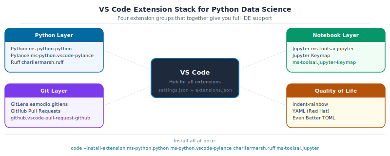

[](https://github.com/sambaiga/ds-mlops-path/blob/main/tutorials/02-dev-tools/00-vscode-setup.qmd)


**DS-MLOps Dev Tools**

**Python 3.12+ | Author: Anthony Faustine**

You can run Python in any text editor. But without type hints highlighting errors before you run, function signatures appearing inline, and a terminal that already knows your project interpreter, you are developing with half your instruments covered. This chapter turns VS Code into a full Python and data science IDE in under 30 minutes.

Parts 1 and 2 gave you the language. Part 14 (`01-uv-project-setup.qmd`) uses this editor to build and run a real project for the first time.

::: {.callout-note collapse="true" icon=false}
## Before you begin

This chapter is the entry point to Part 3. No prior VS Code experience is required. If you already have VS Code installed and use it for Python, focus on sections 4 (uv interpreter), 5 (Ruff integration), and 7 (git extensions): these are the settings that differ from a generic Python setup.

::: {.callout-note collapse="true" icon=false}
:::

## Topics covered

| Topic | Why it matters |
|---|---|
| **Installing VS Code** | The primary editor for DS/ML work in this book |
| **Essential extensions** | Python, Ruff, Jupyter, GitLens: the minimum productive setup |
| **Interpreter selection** | Points VS Code at the uv virtualenv, not the system Python |
| **Format-on-save with Ruff** | Fixes lint and style issues on every save without running commands |
| **Debugger configuration** | Step through pipeline code without print statements |
| **Git integration** | Stage, diff, and review changes without leaving the editor |
:::

> Callout markers used throughout this chapter are explained on the [book cover page](../../index.qmd#callout-guide).

::: {.callout-note collapse="true" icon=false}
## Learning Objectives

By the end of Part 12 you will be able to:

| # | Skill | Covered in |
|---|---|---|
| 1 | Install VS Code and understand the layout of the interface | Sec. 1 |
| 2 | Install and configure the essential extensions for DS/MLOps work | Sec. 2 |
| 3 | Configure `settings.json` for format-on-save with ruff | Sec. 3 |
| 4 | Point VS Code at the uv-managed `.venv` Python interpreter | Sec. 4 |
| 5 | Run and debug Jupyter notebooks directly inside VS Code | Sec. 5 |
| 6 | Use the Source Control panel and GitLens for git operations without the terminal | Sec. 6 |
| 7 | Use the integrated terminal to run `uv` and `git` commands without leaving the editor | Sec. 7 |
:::

Every file in this book is written, run, and debugged in an editor. The configuration in this chapter -- the right Python interpreter, format-on-save, and git integration -- eliminates a class of friction that slows beginners down before they even start writing code. Set it up once here and it carries through every chapter that follows.

## 1. Installing VS Code

VS Code is a free, open-source editor published by Microsoft. It runs on macOS, Linux, and Windows and has the largest Python extension ecosystem of any editor.

Download the installer for your platform from the official site:

> **[code.visualstudio.com/download](https://code.visualstudio.com/download)**


> Source: [VS Code User Interface](https://code.visualstudio.com/docs/getstarted/userinterface)

**macOS:** open the downloaded `.zip`, drag `Visual Studio Code.app` to `/Applications`, then add the `code` CLI:

1. Open VS Code
2. Press `Cmd+Shift+P` to open the Command Palette
3. Type `Shell Command: Install 'code' command in PATH` and press Enter

**Linux (Debian/Ubuntu):**

```bash
sudo apt install ./<downloaded-file>.deb
```

**Windows:** run the installer. The `code` CLI is added to PATH automatically.

Verify the CLI works:

```bash
code --version
```

### Interface overview

The five areas you use most:

| Area | Shortcut | Purpose |
|---|---|---|
| Activity Bar (left strip) | (none) | Switch between Explorer, Search, Source Control, Extensions |
| Explorer | `Cmd/Ctrl+Shift+E` | File tree, open editors |
| Command Palette | `Cmd/Ctrl+Shift+P` | Find and run any VS Code command |
| Integrated Terminal | `` Ctrl+` `` | Shell inside the editor: run `uv`, `git`, `pytest` |
| Status Bar (bottom) | (none) | Active Python interpreter, git branch, errors/warnings count |

## 2. Essential Extensions

The nine extensions below cover every layer of a DS/MLOps project:

{fig-alt="Hub-and-spoke diagram. Center: VS Code. Four surrounding panels: blue Python Layer, green Notebook Layer, purple Git Layer, amber Quality of Life. Each panel lists its extension names and IDs."}

Open the Extensions panel (`Cmd/Ctrl+Shift+X`) and install each of these. The extension ID is in parentheses; paste it into the search box for an exact match.

### Core Python and linting

| Extension | ID | Purpose |
|---|---|---|
| **Python** | `ms-python.python` | IntelliSense, debugging, test discovery |
| **Pylance** | `ms-python.vscode-pylance` | Fast type-aware autocomplete (uses Pyright) |
| **Ruff** | `charliermarsh.ruff` | Lint and format on save using the ruff binary |


> Source: [Ruff VS Code Extension](https://marketplace.visualstudio.com/items?itemName=charliermarsh.ruff)

### Jupyter notebooks

| Extension | ID | Purpose |
|---|---|---|
| **Jupyter** | `ms-toolsai.jupyter` | Run `.ipynb` notebooks in VS Code |
| **Jupyter Keymap** | `ms-toolsai.jupyter-keymap` | Classic Jupyter keyboard shortcuts |

### Git and collaboration

| Extension | ID | Purpose |
|---|---|---|
| **GitLens** | `eamodio.gitlens` | Inline blame, commit history, branch comparison |
| **GitHub Pull Requests** | `github.vscode-pull-request-github` | Review and merge PRs without leaving the editor |

### Quality of life

| Extension | ID | Purpose |
|---|---|---|
| **indent-rainbow** | `oderwat.indent-rainbow` | Colour-coded indentation depth; helps in deeply nested config |
| **YAML** | `redhat.vscode-yaml` | Schema validation for `.pre-commit-config.yaml`, `_quarto.yml` |
| **Even Better TOML** | `tamasfe.even-better-toml` | Syntax and schema support for `pyproject.toml` |

<div class='ark-tip'>
<span class='ark-tip-title'><i class="bi bi-lightbulb-fill"></i> Pro Tip: Save your extension list as a workspace recommendation</span><br><br>
Create <code>.vscode/extensions.json</code> in your project root. When a teammate opens the project, VS Code prompts them to install all recommended extensions automatically:
<pre>{
  "recommendations": [
    "ms-python.python",
    "ms-python.vscode-pylance",
    "charliermarsh.ruff",
    "ms-toolsai.jupyter",
    "eamodio.gitlens"
  ]
}</pre>
</div>

## 3. Configuring `settings.json`

VS Code settings live in `.vscode/settings.json` inside the project (workspace settings) or `~/.config/Code/User/settings.json` (user settings). Workspace settings are committed to git and shared with the team.

Create `.vscode/settings.json` in the `grade-predictor` project:

```json
{
  "[python]": {
    "editor.defaultFormatter": "charliermarsh.ruff",
    "editor.formatOnSave": true,
    "editor.codeActionsOnSave": {
      "source.fixAll.ruff": "explicit",
      "source.organizeImports.ruff": "explicit"
    }
  },
  "[jupyter]": {
    "editor.defaultFormatter": "charliermarsh.ruff",
    "editor.formatOnSave": true
  },
  "python.analysis.typeCheckingMode": "basic",
  "python.analysis.diagnosticMode": "workspace",
  "editor.rulers": [100],
  "files.trimTrailingWhitespace": true,
  "files.insertFinalNewline": true
}
```

What each setting does:

- `editor.defaultFormatter: charliermarsh.ruff`: ruff formats on every save, no Black needed
- `source.fixAll.ruff`: auto-applies safe lint fixes (`--fix`) on save
- `source.organizeImports.ruff`: sorts imports on save (`isort` rules)
- `editor.rulers: [100]`: vertical guide at column 100 (matches `line-length = 100` in `pyproject.toml`)

<div class='ark-concept'>
<span class='ark-concept-title'><i class="bi bi-info-circle-fill"></i> Key Concept: Workspace settings override user settings</span><br><br>
A developer's personal <code>settings.json</code> might use Black as the formatter. When they open your project, the workspace <code>.vscode/settings.json</code> overrides that for Python files only. Their other projects are untouched. This is how you enforce a consistent formatter across a team without overwriting anyone's personal preferences.
</div>

<div class='ark-activity'>
<span class='ark-activity-title'><i class="bi bi-puzzle-fill"></i> Activity 1 - Format on Save</span><br><br>
<b>Goal:</b> Create <code>.vscode/settings.json</code> with the configuration above. Open <code>core.py</code>, add an intentionally badly-formatted function, and save the file. Confirm that ruff reformats it automatically on save. The status bar at the bottom should show no ruff errors.
</div>

## 4. Pointing VS Code at the uv `.venv` Interpreter

After running `uv sync`, a `.venv/` directory exists in the project root. VS Code needs to know about it to provide autocomplete and run code correctly.

**Option A: Auto-detect (VS Code usually picks this up automatically):**

1. Open the project folder (`code .` from the terminal)
2. Look at the bottom-right of the Status Bar, which shows the active Python interpreter
3. Click it, then select the interpreter at `./.venv/bin/python`

**Option B: Set it explicitly in `settings.json`:**

```json
{
  "python.defaultInterpreterPath": "${workspaceFolder}/.venv/bin/python"
}
```


> Source: [VS Code Python Environments](https://code.visualstudio.com/docs/python/environments)

Once the interpreter is set, the IntelliSense for all packages installed by `uv sync` becomes available. Hovering over a pandas function shows its signature; `Cmd+Click` jumps to the source.

<div class='ark-mistake'>
<span class='ark-mistake-title'><i class="bi bi-bug-fill"></i> Common Mistake: Using the system Python or a conda env instead of .venv</span><br><br>
If the Status Bar shows <code>Python 3.x.x 64-bit</code> without a path, VS Code is using the system Python. Packages installed by <code>uv sync</code> will not be visible, autocomplete will be incomplete, and notebooks will fail to import project dependencies. Always confirm the interpreter path ends with <code>.venv/bin/python</code>.
</div>

## 5. Jupyter Notebooks in VS Code

With the Jupyter and Python extensions installed, VS Code opens `.ipynb` files as interactive notebooks. The experience is close to JupyterLab with some advantages: IntelliSense works inside cells, you can set breakpoints, and the Variable Inspector shows live DataFrame previews.


> Source: [VS Code Jupyter Notebooks](https://code.visualstudio.com/docs/datascience/jupyter-notebooks)

Key shortcuts for notebooks in VS Code:

| Action | Shortcut |
|---|---|
| Run cell and move to next | `Shift+Enter` |
| Run cell, stay | `Ctrl+Enter` |
| Insert cell above / below | `A` / `B` (in command mode) |
| Toggle cell type (code/markdown) | `M` / `Y` |
| Restart kernel | `Cmd/Ctrl+Shift+P` → "Restart Kernel" |
| Open Variable Inspector | `Cmd/Ctrl+Shift+P` → "Jupyter: Variables" |

**Select the kernel:** when you first open a notebook, VS Code asks which kernel to use. Choose the `.venv` Python interpreter. This ensures every `import` in the notebook finds the packages installed by `uv sync`.

<div class='ark-activity'>
<span class='ark-activity-title'><i class="bi bi-puzzle-fill"></i> Activity 2 - Run a Notebook in VS Code</span><br><br>
<b>Goal:</b> Open <code>tutorials/01-python-basics/08-pandas-core.ipynb</code> in VS Code. Select the <code>.venv</code> kernel. Run the first three cells with <code>Shift+Enter</code>. Open the Variable Inspector and confirm the DataFrame is visible. Change one cell to produce a different output and save.
</div>

## 6. Git and GitLens in VS Code

VS Code has a built-in Source Control panel (`Cmd/Ctrl+Shift+G`). It shows every modified file as a coloured indicator in the Explorer and in the Source Control panel, where you can stage, commit, and push without touching the terminal.


> Source: [VS Code Source Control](https://code.visualstudio.com/docs/sourcecontrol/overview)

### GitLens features

GitLens enhances the built-in git support. The three features used most in DS work:

**Inline blame:** hover over any line to see who wrote it and when. Useful when debugging a pipeline step someone else wrote.

**File History:** right-click a file → "Open File History" to see every commit that touched it as a timeline.

**Branch comparison:** in the GitLens sidebar, compare two branches to see exactly which files and lines differ, useful before opening a PR.


> Source: [GitLens documentation](https://help.gitkraken.com/gitlens/gitlens-start-here/)

### GitHub Pull Requests extension

With the GitHub Pull Requests extension, you can:

- See open PRs in a sidebar panel
- Leave inline review comments directly in the diff view
- Check out a PR branch with one click
- Merge a PR without leaving VS Code

<div class='ark-tip'>
<span class='ark-tip-title'><i class="bi bi-lightbulb-fill"></i> Pro Tip: Use the editor's diff view to review your changes before committing</span><br><br>
Click any modified file in the Source Control panel to open a side-by-side diff. This is the best way to catch accidental changes (a stray debug print, a hardcoded path, a dropped import) before they enter git history.
</div>

## 7. Integrated Terminal

The integrated terminal (`` Ctrl+` ``) opens a shell inside VS Code with the current project directory already set. Split it into multiple panes with the split icon to run a test suite in one pane and a Quarto preview in another.

```bash
# Run in the integrated terminal exactly as you would in a standalone shell
uv run ruff check .
uv run pytest tests/ -v
uv run quarto preview
```

VS Code activates the `.venv` environment automatically in the integrated terminal when it detects a workspace interpreter. You can confirm this by running:

```bash
which python
# /path/to/grade-predictor/.venv/bin/python
```

<div class='ark-activity'>
<span class='ark-activity-title'><i class="bi bi-puzzle-fill"></i> Activity 3 - Full Workflow in VS Code</span><br><br>
<b>Goal:</b> Without leaving VS Code, complete this sequence:
<ol>
<li>Open the integrated terminal. Run <code>uv run ruff check src/</code> and fix any findings.</li>
<li>Open the Source Control panel. Stage the changed files and write a conventional commit message.</li>
<li>Use the GitLens File History on <code>core.py</code> to view its commit history.</li>
<li>Push the commit using the Source Control panel's sync button.</li>
</ol>
</div>

## Capstone - A Configured Development Environment

Set up your `grade-predictor` project so the full Dev Tools stack runs seamlessly inside VS Code.

<div class='ark-activity'>
<span class='ark-activity-title'><i class="bi bi-puzzle-fill"></i> Capstone - Zero-friction Setup</span><br><br>
<ol>
<li>Install all extensions listed in Section 2</li>
<li>Create <code>.vscode/settings.json</code> with format-on-save and the ruff formatter</li>
<li>Create <code>.vscode/extensions.json</code> with the five core extension recommendations</li>
<li>Confirm VS Code is using <code>.venv/bin/python</code> as the interpreter</li>
<li>Open a notebook, select the <code>.venv</code> kernel, and run it top to bottom without errors</li>
<li>Make a small change, stage it in the Source Control panel, and commit with a conventional commit message</li>
</ol>
</div>

::: {.callout-note collapse="true" icon=false}
## Further Reading

| Resource | Why it matters |
|---|---|
| [VS Code Python tutorial](https://code.visualstudio.com/docs/python/python-tutorial) | Official walkthrough: install, run, debug |
| [VS Code Jupyter docs](https://code.visualstudio.com/docs/datascience/jupyter-notebooks) | Kernel selection, Variable Inspector, cell magic |
| [Ruff VS Code extension](https://marketplace.visualstudio.com/items?itemName=charliermarsh.ruff) | Configuration options beyond format-on-save |
| [GitLens docs](https://help.gitkraken.com/gitlens/gitlens-start-here/) | Full feature reference for blame, history, and compare |
| [VS Code keybindings](https://code.visualstudio.com/docs/getstarted/keybindings) | Printable cheat sheet for all platforms |
:::

::: {.callout-note collapse="true" icon=false}
## Summary

| Concept | Key rule |
|---|---|
| Interpreter | Always use `.venv/bin/python` from `uv sync`. Check the Status Bar before running anything. |
| Format on save | Set `charliermarsh.ruff` as the default Python formatter. Ruff replaces Black and isort. |
| Workspace settings | `.vscode/settings.json` is committed; it enforces the formatter for the whole team. |
| `.vscode/extensions.json` | Committed; VS Code prompts teammates to install the recommended extensions. |
| Kernel selection | A notebook's kernel must match the project's `.venv` or imports will fail silently. |
| Source Control panel | Stage, commit, push without the terminal. Use the diff view to review before committing. |
:::

**Next:** [Part 13: Project Setup with uv](01-uv-project-setup.qmd) builds the `grade-predictor` project that the rest of Part 3 operates on.
