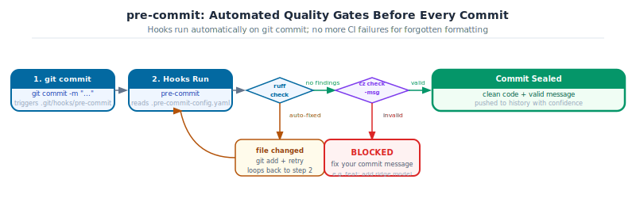

[](https://github.com/sambaiga/ds-mlops-path/blob/main/tutorials/02-dev-tools/06-pre-commit-automation.qmd)


**DS-MLOps Dev Tools**

**Python 3.12+ | Author: Anthony Faustine**

You push a commit. CI fails because ruff found an unused import you missed. You fix it and push again. CI fails again -- the commit message format is wrong. Each round trip costs five minutes and breaks your focus. `pre-commit` runs every quality check automatically the moment you type `git commit`, so the CI pipeline never fails for something a script could have caught locally.

Part 17 (`05-pytest-testing.qmd`) added tests. This chapter automates ruff, pytest, and commit-message validation as git hooks. Part 19 (`07-pydantic-validation.ipynb`) introduces runtime data validation.

::: {.callout-note collapse="true" icon=false}
## Before you begin

This chapter assumes you have completed [Part 13](01-uv-project-setup.qmd) through [Part 17](05-pytest-testing.qmd). The `grade-predictor` project should have typed, linted, tested code under version control. This chapter automates every quality check so they run without remembering to.

The `.pre-commit-config.yaml` used by this book itself is the live reference for every pattern shown here. When you see a hook described, you can find its working configuration in the book repository.

::: {.callout-note collapse="true" icon=false}
:::

## Topics covered

| Topic | Why it matters |
|---|---|
| **Git hooks** | Scripts that run automatically at commit, push, or other git events |
| **`.pre-commit-config.yaml`** | Declarative hook list with pinned versions and auto-update |
| **Ruff and format hooks** | Lint and auto-fix before a commit can land |
| **`nbstripout`** | Remove notebook outputs so git diffs stay readable |
| **`commitizen`** | Enforce Conventional Commit messages at commit time |
| **`pre-commit run --all-files`** | Apply all hooks to the full codebase in one command |
:::

> Callout markers used throughout this chapter are explained on the [book cover page](../../index.qmd#callout-guide).

::: {.callout-note collapse="true" icon=false}
## Learning Objectives

By the end of Part 18 you will be able to:

| # | Skill | Covered in |
|---|---|---|
| 0 | Explain what pre-commit is and install it | Sec. 0 |
| 1 | Explain what a git hook is and why pre-commit manages them | Sec. 1 |
| 2 | Write a `.pre-commit-config.yaml` with the essential DS hooks | Sec. 2 |
| 3 | Use `nbstripout` to keep notebook outputs out of git history | Sec. 3 |
| 4 | Configure commitizen to enforce conventional commits automatically | Sec. 4 |
| 5 | Assign hooks to the right stage: `pre-commit` vs `pre-push` | Sec. 5 |
| 6 | Debug a hook failure and use the `SKIP` escape hatch correctly | Sec. 6 |
:::

## 0. What is pre-commit and How to Install It

`pre-commit` is a framework for managing git hooks. It lets you define a set of automated checks in a single YAML file (`.pre-commit-config.yaml`) that is committed with your code. Anyone who clones the repository and runs `pre-commit install` gets the identical set of checks running on their machine, each in its own isolated environment with pinned tool versions.

Without pre-commit, quality checks are optional. With pre-commit, they are automatic: the checks run before every commit and block it if they fail. You cannot forget to run ruff, and your colleagues cannot skip it.

{fig-alt="Flow diagram. git commit (blue) to pre-commit hooks (blue). Diamond: ruff check. Auto-fixed path (amber): file changed, git add, retry. No-findings path to second diamond: commitizen. Invalid format (red): commit BLOCKED. Valid format (green): commit sealed."}

### Install pre-commit

In the `grade-predictor` project, pre-commit is already listed as a dev dependency and is installed with `uv sync`:

```bash
# Already included if you ran: uv sync --extra dev
uv add --optional dev pre-commit

# Activate the hooks for this repository (run once after every fresh clone)
uv run pre-commit install
```

For use outside a uv project, or as a system-wide tool:

```bash
# via pipx (recommended for standalone use)
pipx install pre-commit

# via pip (in any active environment)
pip install pre-commit

# macOS via Homebrew
brew install pre-commit

# Verify
pre-commit --version
```

<div class='ark-concept'>
<span class='ark-concept-title'><i class="bi bi-info-circle-fill"></i> Key Concept: pre-commit install wires the hooks; it must run after every clone</span><br><br>
The <code>.pre-commit-config.yaml</code> file describes <i>what</i> to run. <code>pre-commit install</code> writes the actual hook scripts into <code>.git/hooks/</code>. This second step is local-only and not version-controlled, so every developer who clones the repo must run it once. A good project README always lists it as a setup step.
</div>

## 1. Git Hooks and Why pre-commit Manages Them

A git hook is a script that runs at a specific point in the git workflow. `pre-commit` runs before `git commit` seals the commit; `commit-msg` runs after you write the message; `pre-push` runs before `git push` sends to the remote. Hooks can block the operation if they exit with a non-zero code.

Without pre-commit, hooks are raw shell scripts in `.git/hooks/`. They are not version-controlled, so every clone starts with no hooks. Each developer installs them differently. Enforcement is inconsistent.

Pre-commit solves this by managing hooks as configuration: `.pre-commit-config.yaml` is committed to the repository. Anyone who clones it and runs `pre-commit install` gets the identical set of hooks, each running in an isolated environment with pinned tool versions.

```bash
uv add --optional dev pre-commit
uv run pre-commit install          # install hooks into .git/hooks/
```

This two-step setup must happen once after every clone.

<div class='ark-concept'>
<span class='ark-concept-title'><i class="bi bi-info-circle-fill"></i> Key Concept: <code>pre-commit install</code> must run after every clone</span><br><br>
The hooks live in <code>.pre-commit-config.yaml</code> (versioned, shared), not in <code>.git/hooks/</code> (not versioned, local only). <code>pre-commit install</code> writes the actual hook scripts into <code>.git/hooks/</code> based on the config. Without running it, no hooks execute. Add it to your project README under "Getting started".
</div>

## 2. The Essential DS Hooks

A complete `.pre-commit-config.yaml` for a DS project:

```yaml
default_language_version:
  python: python3.12

exclude: '(\.venv/|__pycache__/|\.pytest_cache/|_freeze/)'

repos:
  - repo: https://github.com/pre-commit/pre-commit-hooks
    rev: v4.6.0
    hooks:
      - id: check-yaml
      - id: check-json
      - id: check-toml
      - id: end-of-file-fixer
      - id: trailing-whitespace
      - id: check-added-large-files
        args: [--maxkb=1200]       # block files larger than 1.2MB
      - id: detect-private-key     # catch secrets before they leave the machine
      - id: check-merge-conflict
      - id: no-commit-to-branch    # prevent direct commits to main

  - repo: https://github.com/astral-sh/ruff-pre-commit
    rev: v0.5.0
    hooks:
      - id: ruff
        args: [--fix, --exit-non-zero-on-fix]
        types_or: [python, pyi, jupyter]
      - id: ruff-format
        types_or: [python, pyi, jupyter]

  - repo: local
    hooks:
      - id: nbstripout-dev
        name: nbstripout (dev)
        entry: nbstripout --keep-output
        language: python
        types: [jupyter]
        additional_dependencies: [nbstripout]
        stages: [pre-commit]
```

Walking through the important ones:

- `check-added-large-files`: blocks data files committed accidentally. 1.2MB catches most CSVs.
- `detect-private-key`: scans for PEM headers and common secret patterns. Not foolproof, but catches the common cases.
- `no-commit-to-branch`: prevents direct commits to `main`. All changes go through branches.
- `ruff --fix --exit-non-zero-on-fix`: runs ruff, applies auto-fixes, and then exits non-zero if it changed anything. This forces you to stage the fix before re-committing, which keeps the staging area honest.

<div class='ark-activity'>
<span class='ark-activity-title'><i class="bi bi-puzzle-fill"></i> Activity 1 - First Hook Run</span><br><br>
<b>Goal:</b> Create <code>.pre-commit-config.yaml</code> in <code>grade-predictor</code> with the config above. Run <code>pre-commit install</code>. Then try to commit a Python file with an unused import. Observe the hook blocking the commit and fixing the file. Stage the fix and commit again.
<pre>uv run pre-commit install
# add unused import to core.py
git add src/grade_predictor/core.py
git commit -m "test: intentional ruff failure"
# ruff should block and fix
git add src/grade_predictor/core.py
git commit -m "style: ruff auto-fixed unused import"</pre>
</div>

## 3. nbstripout: Keeping Notebooks Clean

This is the one hook that almost no standard pre-commit tutorial covers, but it is essential for any DS project with Jupyter notebooks.

Jupyter saves cell outputs, plots, and printed values inside the `.ipynb` JSON file. Without stripping them, every re-run of a notebook produces a diff of hundreds of lines even when the code itself has not changed. `git diff` becomes unreadable. `git blame` becomes useless. PRs accumulate thousands of lines of changed JSON that nobody reviews.

Two modes, two stages:

```yaml
- repo: local
  hooks:
    - id: nbstripout-dev
      name: nbstripout (dev)
      entry: nbstripout --keep-output     # strip metadata, keep outputs for review
      language: python
      types: [jupyter]
      additional_dependencies: [nbstripout]
      stages: [pre-commit]

    - id: nbstripout-ci
      name: nbstripout (ci)
      entry: nbstripout --drop-empty-cells  # strip everything before pushing
      language: python
      types: [jupyter]
      additional_dependencies: [nbstripout]
      stages: [pre-push]
```

The `--keep-output` version keeps outputs in the committed file so reviewers can see what a cell produces without running it. The `--drop-empty-cells` version at push time ensures the remote branch has clean JSON that CI can read without noise.

<div class='ark-example'>
<span class='ark-example-title'><i class="bi bi-journal-code"></i> Example: Before and after nbstripout</span><br><br>
Without nbstripout, a notebook <code>git diff</code> after re-running a cell with a matplotlib plot looks like:<br>
<pre>-   "outputs": [{"data": {"image/png": "iVBORw0KGgoAAAANSU..."}, ...}]
+   "outputs": [{"data": {"image/png": "iVBORw0KGgoAAAANSU..."}, ...}]</pre>
Thousands of base64 characters, one line each. The code changed by two characters. With nbstripout, the diff is two lines.
</div>

<div class='ark-activity'>
<span class='ark-activity-title'><i class="bi bi-puzzle-fill"></i> Activity 2 - Clean Notebook Diffs</span><br><br>
<b>Goal:</b> Add <code>nbstripout-dev</code> to your <code>.pre-commit-config.yaml</code>. Create a simple notebook in <code>grade-predictor</code>, run a cell that prints a value, save it, then run <code>git diff</code>. Confirm the output is stripped in the staged version. Commit and push.
<pre>git add notebooks/analysis.ipynb
git diff --staged     # should show code, not output JSON</pre>
</div>

## 4. commitizen: Enforcing Conventional Commits

In [Part 16](04-git-github.qmd), you wrote conventional commit messages by hand. Commitizen enforces the format automatically via a `commit-msg` hook, and provides `cz commit` as an interactive alternative to `git commit -m`.

Add to `pyproject.toml`:

```toml
[tool.commitizen]
bump_message = "bump: v$current_version to v$new_version"
tag_format = "v$version"
update_changelog_on_bump = true
version_provider = "pep621"
```

Add to `.pre-commit-config.yaml`:

```yaml
  - repo: local
    hooks:
      - id: commitizen
        name: commitizen
        entry: cz check
        args: [--commit-msg-file]
        require_serial: true
        language: system
        stages: [commit-msg]

  - repo: https://github.com/commitizen-tools/commitizen
    rev: v4.9.1
    hooks:
      - id: commitizen-branch
        stages: [pre-push]
```

With this in place, `git commit -m "update stuff"` is blocked. `git commit -m "fix(core): correct weight normalization"` passes. `cz commit` walks you through the format interactively.

Two more commitizen commands that pay for themselves:

```bash
cz bump           # reads commit history, bumps version automatically
cz changelog      # generates CHANGELOG.md from commit history
```

`feat` commits bump the minor version. `fix` commits bump the patch. With `update_changelog_on_bump = true`, the changelog writes itself.

<div class='ark-tip'>
<span class='ark-tip-title'><i class="bi bi-lightbulb-fill"></i> Pro Tip: <code>cz bump</code> replaces manual version management</span><br><br>
Without commitizen, bumping a version means editing <code>pyproject.toml</code>, updating <code>CHANGELOG.md</code>, tagging the commit, and pushing the tag. With commitizen: <code>cz bump</code> does all four in one command, reading the commit history to determine whether this is a major, minor, or patch release.
</div>

<div class='ark-activity'>
<span class='ark-activity-title'><i class="bi bi-puzzle-fill"></i> Activity 3 - Commitizen in Action</span><br><br>
<b>Goal:</b> Add commitizen to your project. Try to commit with <code>git commit -m "update stuff"</code> and confirm it is blocked. Then commit the same change with a valid conventional message. Finally, run <code>cz changelog</code> and inspect the generated output.
<pre>git commit -m "update stuff"              # should fail
git commit -m "docs: update README with setup instructions"  # should pass
uv run cz changelog</pre>
</div>

## 5. Stages: `pre-commit` vs `pre-push`

Hooks can run at different stages. The choice determines how much latency you accept:

| Stage | When it runs | Right for |
|---|---|---|
| `pre-commit` | Before every commit, locally | Fast checks: ruff, end-of-file-fixer, nbstripout |
| `commit-msg` | After writing the commit message | Message validation: commitizen |
| `pre-push` | Before `git push` | Slower checks: type checking (ty), nbstripout clean pass |

A slow `pre-commit` hook runs on every commit, including small work-in-progress commits on a personal branch. A slow `pre-push` hook runs less often and tolerates more latency, because pushing is a deliberate action.

The rule: if a check takes more than 5 seconds, move it to `pre-push`. If it breaks CI anyway, move it there. Keep `pre-commit` fast so that committing often stays frictionless.

Assign a hook to a stage with `stages: [pre-push]`:

```yaml
  - repo: local
    hooks:
      - id: ty-check
        name: ty (type check)
        entry: uv run ty check src/
        language: system
        pass_filenames: false
        stages: [pre-push]
```

## 6. Debugging Failures and the SKIP Escape Hatch

When a hook fails, git blocks the commit. The hook output explains why. Read the first line of the failure: it names the hook, the file, and the rule.

The most common failure pattern: ruff finds an issue, fixes it, and exits non-zero. The file is now changed but not staged. The fix is:

```bash
git add src/grade_predictor/core.py   # stage the fix ruff just made
git commit -m "fix(core): address ruff finding"
```

The `SKIP` environment variable bypasses specific hooks for one commit:

```bash
SKIP=ruff git commit -m "wip: draft in progress"
```

`SKIP` is the right tool for work-in-progress commits on a personal branch where you intend to clean up before merging. It bypasses only the named hook, not all hooks.

`pre-commit run --all-files` runs all hooks on every file, not just staged ones. Use it as a one-time audit when setting up a new project or after adding a new hook:

```bash
uv run pre-commit run --all-files
```

<div class='ark-mistake'>
<span class='ark-mistake-title'><i class="bi bi-bug-fill"></i> Common Mistake: Using <code>--no-verify</code></span><br><br>
<code>git commit --no-verify</code> bypasses all hooks at once: commitizen, ruff, detect-private-key, nbstripout, everything. There is almost no legitimate reason for it on a shared branch. Use <code>SKIP=&lt;hook-id&gt;</code> to bypass only the hook that is blocking you. If you find yourself reaching for <code>--no-verify</code> regularly, the hook is probably too slow or misconfigured, and that is the real problem to fix.
</div>

## Capstone - Complete pre-commit Pipeline

Set up the full automation pipeline for `grade-predictor`.

<div class='ark-activity'>
<span class='ark-activity-title'><i class="bi bi-puzzle-fill"></i> Capstone - Zero Findings</span><br><br>
<ol>
<li>Create <code>.pre-commit-config.yaml</code> with: <code>pre-commit-hooks</code> (yaml, json, large files, private key, no-commit-to-branch), ruff + ruff-format, nbstripout (dev), commitizen (commit-msg stage)</li>
<li>Run <code>pre-commit install</code></li>
<li>Run <code>pre-commit run --all-files</code> and fix every finding</li>
<li>Make a final commit using <code>cz commit</code> with a valid conventional message</li>
<li>Push to GitHub and confirm CI runs green</li>
</ol>
<pre>uv run pre-commit run --all-files
uv run cz commit</pre>
</div>

::: {.callout-note collapse="true" icon=false}
## Further Reading

| Resource | Why it matters |
|---|---|
| [pre-commit documentation](https://pre-commit.com/) | Hook configuration, staging, and custom hook authoring |
| [nbstripout documentation](https://github.com/kynan/nbstripout) | Options for output stripping and CI integration |
| [commitizen documentation](https://commitizen-tools.github.io/commitizen/) | `cz commit`, `cz bump`, `cz changelog` reference |
| [pre-commit hooks list](https://pre-commit.com/hooks.html) | Full list of community hooks, searchable by language |
:::

::: {.callout-note collapse="true" icon=false}
## Summary

| Concept | Key rule |
|---|---|
| `pre-commit install` | Run once after every clone. Without it, no hooks run. |
| nbstripout | Every DS project with notebooks needs this. Unstripped outputs make `git diff` unreadable. |
| `stages: [pre-commit]` | Fast checks only. Slow hooks belong at `pre-push`. |
| commitizen | Enforces conventional commits automatically. `cz commit` is the interactive alternative. |
| `SKIP=<id>` | Bypass one specific hook for a `wip` commit. Never use `--no-verify`. |

**What is next:** With the full dev tools stack in place, Part 4 covers Classical Machine Learning: building, evaluating, and comparing models on `university_analytics.csv` using the clean, tested, versioned codebase you have built here.
:::
